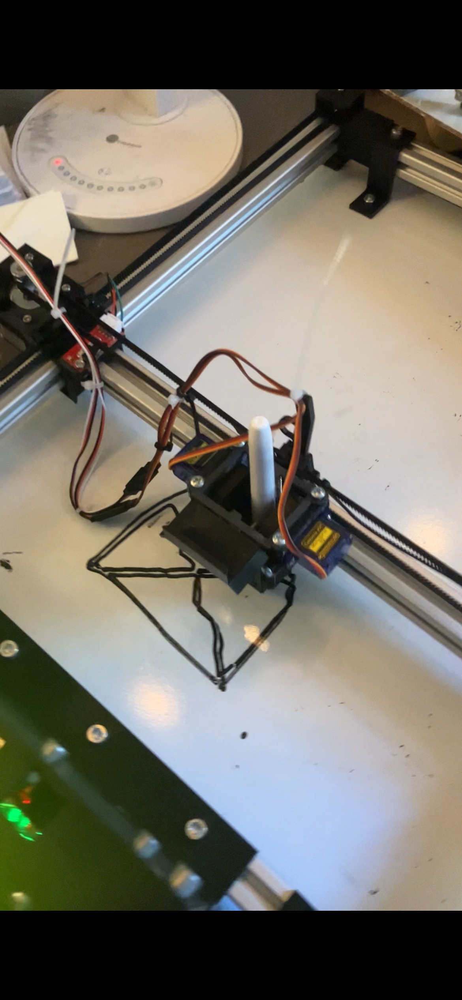

<h1>2D Plotter / 2D Printer</h1>

<h2>Description</h2>

During my freshman year of college, I collaborated with upper-classmen and peers to build a
custom 2D printer capable of drawing on a vertical whiteboard surface. The system used four locking
stepper motors to precisely control motion along the X and Y axes, allowing a dry-erase marker to be
positioned.

<h2>Project Objectives</h2>
<ul>
  <li>Build a functional 2-axis motion system</li>
  <li>Implement motor control using stepper motors</li>
  <li>Implement firmware to translate commands into motion</li>
  <li>Gain hands-on experience with wiring, assembly, and debugging</li>
</ul>

<h2>Technical Overview</h2>

The printer frame supported a belt-driven motion system controlled by four locking stepper motors.
An embedded microcontroller was programmed in C to coordinate motor timing, direction, and positioning.
The dry-erase marker was mounted to the moving carriage and followed programmed paths across the board.

<h2>Skills & Concepts Learned</h2>
<ul>
  <li>Crimping and splicing electrical connections</li>
  <li>Soldering through-hole and wire connections</li>
  <li>C programming for embedded systems</li>
  <li>Stepper motor control and timing</li>
  <li>System-level troubleshooting and debugging</li>
  <li>Team-based engineering collaboration</li>
</ul>

<h2>Results</h2>

The final system successfully produced repeatable drawings on a whiteboard surface, demonstrating
accurate motor coordination and reliable electrical connections. The project provided foundational
experience in mechatronics and embedded systems design.

<h2>Project Image</h2>

